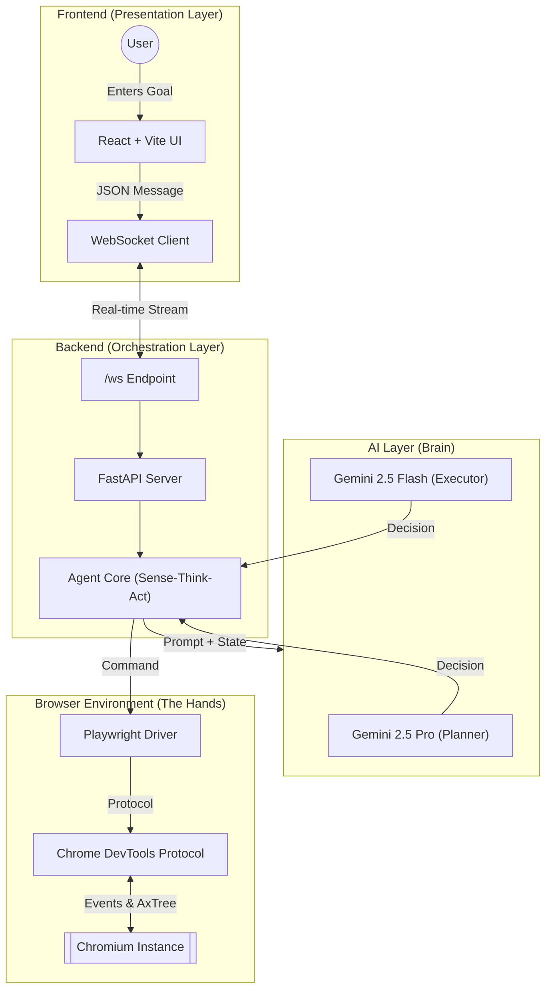
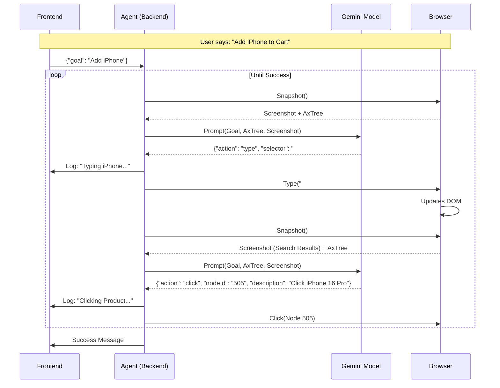

# Technical Deep Dive: Agentic Web Automation with Gemini 2.5
**Target Audience**: Dev Leads, Python Team Leads, SDET Leads  
**Purpose**: System Architecture, Tooling Decisions, and Data Flow Analysis

---

## 1. Core Automation Concepts
*High-level definitions of the underlying technologies used in this MVP.*

### **CDP (Chrome DevTools Protocol)**
**What is it?**: A low-level debugging protocol that allows direct, bidirectional communication with Chrome/Chromium instances.  
**How we use it**: Standard automation (Selenium/Playwright) relies on high-level selectors. We use CDP to "bypass" the UI layer to access the **Accessibility Tree** and **Console Logs** directly. It essentially gives our Agent "X-Ray vision" into the browser's internal state.

### **WebDriver BiDi (Bidirectional)**
**What is it?**: The next-generation standard for browser automation that standardizes the event-driven capabilities of CDP across *all* browsers (Firefox, Safari, Chrome).  
**Relevance**: While this MVP uses Playwright's CDP wrapper (Chrome-specific), adopting BiDi in the future would allow our Agent to capture asynchronous events (log streams, network errors, DOM mutations) in real-time across any browser without vendor lock-in.

### **DOM (Document Object Model)**
**What is it?**: The complete tree structure of HTML tags (`
`, ``, `style=...`) that renders the web page.  
**Why NOT use it exclusively**: The DOM is extremely verbose. A simple "Sign In" button might be nested in 10 layers of `div`s with Tailwind classes. Feeding raw DOM to an LLM wastes context window (tokens) and confuses the model with irrelevant styling information.

### **AxTree (Accessibility Tree)**
**What is it?**: A semantic subset of the DOM used by screen readers (assistive technology). It strips away usage-less `div`s and exposes only *interactive* and *meaningful* content (e.g., `Role: Button`, `Name: "Submit"`, `State: Disabled`).  
**Why we use it**:
1.  **Token Efficiency**: Reduces input size by ~90% compared to raw HTML.
2.  **Human-like Perception**: The Agent "sees" the page functionality (e.g., "This is a button") rather than implementation details (e.g., `<a class="btn-primary"...>`), making it far more robust to UI refactors.

---

## 2. System Architecture & Data Flow

### **High-Level System Diagram**
Visualizing the connections between the User, the Orchestrator, and the Target.

### **The "Sense-Think-Act" Loop**
The system acts as an autonomous agent that loops through three phases until the goal is achieved.

**Scenario: "Add an iPhone to the Cart on Amazon"**

#### **Step 1: Sense (The Input)**
*   **Trigger**: Frontend sends WebSocket message: `{"goal": "Add iPhone to cart"}`.
*   **BrowserService**:
    1.  **Visual**: Captures a JPEG Screenshot (What the human sees).
    2.  **Structural**: Extracts **AxTree** via CDP (What the machine understands).
    3.  **Events**: Captures Console Logs/Errors.
*   **Data Packet**: Consolidated into a prompt for the LLM.

#### **Step 2: Think (The Brain)**
*   **Routing Logic**:
    *   **Is this the start?** -> Use **Gemini 2.5 Pro** (Better Planning).
    *   **Did the last step fail?** -> Use **Gemini 2.5 Pro** (Better Debugging).
    *   **Normal execution?** -> Use **Gemini 2.5 Flash** (Fast & Cheap).
*   **The Model**: Analyzes the Screenshot + AxTree.
    *   *Thought*: "I am on the Amazon homepage. I see a search box (Node #45). The goal is to find an iPhone."
    *   *Decision*: "Action: Type 'iPhone 16' into Node #45."
*   **Output**: JSON Object `{"action": "type", "nodeId": "45", "value": "iPhone 16"}`.

#### **Step 3: Act (The Hands)**
*   **AgentCore**: Parses JSON.
*   **BrowserService**:
    1.  Receives target `nodeId: 45`.
    2.  Uses CDP `DOM.getBoxModel(nodeId)` to find exact X,Y screen coordinates.
    3.  Simulates human input: Click(X,Y) -> Type("iPhone 16") -> Press("Enter").
*   **Loop**: Verification runs. The page reloads. We go back to **Sense**.

### **Real-Life Data Flow: "Add Product" Sequence**

---

## 3. Tech Stack Deep Dive

### **Frontend: React 19 + Vite**
*   **Framework**: **React 19** (Latest). We chose React for its component-based architecture, which allows us to build a modular UI (LogConsole, BrowserView, ControlPanel).
*   **Build Tool**: **Vite**. Chosen for its lightning-fast HMR (Hot Module Replacement) and optimized build times compared to Webpack.
*   **Communication**: **Native WebSockets**.
    *   Unlike traditional HTTP (REST) where the client polls for updates, WebSockets allow the Backend to **push** screenshots and logs to the UI instantly.
    *   This is critical for the "Live Browser Stream" feature, where latency mimics a video feed.

### **Backend: FastAPI + Custom Agent Architecture**
*   **Server**: **FastAPI**. High-performance, async-native Python framework.
*   **Custom Agent (vs. Development Kits)**: 
    *   We use the **Google Generative AI SDK** (`google-generativeai`) directly.
    *   **Why not "Vertex AI Agent Builder"?**: Pre-built agent kits are often "black boxes". By building our own `AgentCore` class, we gain:
        1.  **Full Control over Prompt Engineering**: We can inject specific CDP data (AxTree) that off-the-shelf agents might ignore.
        2.  **Fine-Grained Model Switching**: We explicitly route easier tasks to *Flash* and harder tasks to *Pro*.
        3.  **CDP Integration**: We can tightly couple the LLM's output (`nodeId`) to the browser's low-level protocol.

### **The Intelligence: Dual-Model Strategy**

| Feature | Gemini 2.5 Pro | Gemini 2.5 Flash |
| :--- | :--- | :--- |
| **Role** | **Planner & Debugger** | **Executor** |
| **When used?** | Start of task, or after an error. | Routine clicks, typing, scrolling. |
| **Strength** | Reasoning, Complex Logic, Planning. | Speed, Cost-efficiency, Low Latency. |
| **Context** | "I need a strategy to find the login form." | "I see the button. Clicking it." |
